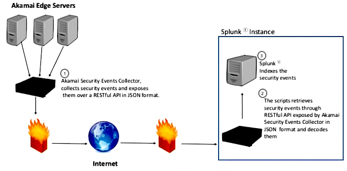

# Issue description

Have a customer having issues configuring the API to get Security logs.

1.- Ask for more details such as the account the customer was using&#x20;

2.- Verifying that SIEM was turned on the WAF

3.- Review correct permissions on API users.

&#x20;Know why the logs were not being delivered properly.

1.- Review the token the customer was using.

2.- Review the error code the customer was getting when trying to retrieve logs.

Start investigating, reading, and asking. Talked with a senior member (creating an escalation with what I found).

1.- After checking all the initial setups, I asked a senior member, and he told me that we could ask for the Syslog and some other files to review the configuration.

2.- Reviewing these logs and files with the customer to assist in a proper configuration on the server side.

3.- Since the customer was using a cloud server, reviewed logs and  assisted on how to configure FirewallD to allow ingestion of data

&#x20;Understanding a lot about the API, being able to test not only this API but others, and being able to pass that knowledge to my team via training

1.- After resolving the issue, documented everything that I found and the information provided and gathered and gave training to my team about it.

\

[https://techdocs.akamai.com/siem-integration/docs/siem-splunk-connector](https://techdocs.akamai.com/siem-integration/docs/siem-splunk-connector)

